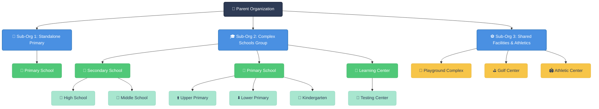

# 🌱 Ifitwala Ed

## A Unified Institutional Operating System for Education

**Ifitwala_Ed** is an open-source **Institutional Operating System** that replaces fragmented SaaS tools with **one coherent data model, one permission system, and one analytics surface**.

Built on the enterprise-grade **Frappe Framework**, it is designed for schools, colleges, and universities that value **data sovereignty, architectural integrity, long-term scalability, and true integration between all the stakeholders and various domains of your educational institution .**

---

## 🚀 The Paradigm Shift

Most educational institutions operate on a "Frankenstein stack": an SIS for enrollment, an LMS for grading, a distinct admission module, a separate timetable tool, a HR module that is not connected to education, an accounting software unrelated to the needs of an education institution, a Tableau dashboard for analytics, and endless spreadsheets to bridge the gaps.

**The result?** Data is duplicated, permissions drift, analytics require manual reconciliation, and staff spent time moving information instead of acting on it.

**Ifitwala_Ed eliminates fragmentation at the root.**
We do not build "integrations" between disconnected modules. We build **one backbone** where every module — Academic, Operation, Analytics, Admission, HR, Marketing & Communication, and Financial — references the same single source of truth.

**Ifitwala is an Education ERP - Education Resource Platform.**
Yes Education institution are not and should not be compared and considered as "Entreprise".  The model, fundamentally human at its core, is different and Ifitwala Ed is build around capturing that difference in both its UI-UX design and architecture.

---

## 🏛️ Architecture: The Nested Set Hierarchy

Education is hierarchical by nature. Ifitwala Ed reflect this structure at its core.

Ifitwala_Ed uses a **Nested Set Hierarchy** to model the reality of your institution. This is a lot more than just a labeling system; it is the logic engine that drives permissions, reporting, and policy inheritance throughout the whole system.

This allows a true multi-campuses and multi-schools platform with each entities having its own models, management organization, data structure, workflows.

### Visualizing the Nested Reality


```mermaid
graph TD
    %% Nodes Definition
    ORG[🏢 Parent Organization]

    %% Level 1: Sub-Organizations
    SO1[🏫 Sub-Org 1: Standalone Primary]
    SO2[🎓 Sub-Org 2: Complex Schools Group]
    SO3[⚽ Sub-Org 3: Shared Facilities & Athletics]

    %% Level 2: Schools and Major Entities (Children of L1)
    SO1_PRI[🎒 Primary School]

    SO2_SEC[🏫 Secondary School]
    SO2_PRI[🏫 Primary School]
    SO2_LC[🧠 Learning Center]

    SO3_PLAY[🛝 Playground Complex]
    SO3_GOLF[⛳ Golf Center]
    SO3_GYM[🏟️ Athletic Center]

    %% Level 3: Sub-Divisions (Children of L2)
    SO2_HS[📜 High School]
    SO2_MS[📘 Middle School]

    SO2_UP[⬆️ Upper Primary]
    SO2_LP[⬇️ Lower Primary]
    SO2_KG[🧸 Kindergarten]

    SO2_TC[📝 Testing Center]

    %% Relationships Structure
    ORG --> SO1 & SO2 & SO3

    SO1 --> SO1_PRI

    SO2 --> SO2_SEC & SO2_PRI & SO2_LC
    SO2_SEC --> SO2_HS & SO2_MS
    SO2_PRI --> SO2_UP & SO2_LP & SO2_KG
    SO2_LC --> SO2_TC

    SO3 --> SO3_PLAY & SO3_GOLF & SO3_GYM

    %% Elegant Styling Definition
    classDef rootNode fill:#2E3B55,stroke:#1B263B,stroke-width:2px,color:#fff,rx:5px,ry:5px;
    classDef lvl1Node fill:#4A90E2,stroke:#357ABD,stroke-width:2px,color:#fff,rx:5px,ry:5px;
    classDef lvl2Node fill:#50C878,stroke:#3DAF65,stroke-width:1px,color:#fff,rx:5px,ry:5px;
    classDef lvl3Node fill:#A8E6CF,stroke:#8FD4BD,stroke-width:1px,color:#2E3B55,rx:5px,ry:5px;
    classDef facilityNode fill:#F7C548,stroke:#E1B137,stroke-width:1px,color:#2E3B55,rx:5px,ry:5px;

    %% Apply Styles
    class ORG rootNode;
    class SO1,SO2,SO3 lvl1Node;
    class SO1_PRI,SO2_SEC,SO2_PRI,SO2_LC lvl2Node;
    class SO2_HS,SO2_MS,SO2_UP,SO2_LP,SO2_KG,SO2_TC lvl3Node;
    class SO3_PLAY,SO3_GOLF,SO3_GYM facilityNode;
```

**Why this matters:**

**Why this matters:**

1. **Hierarchical Permissions, Instantly**
   Access flows down the tree. A user with rights to a parent node automatically sees all descendants—whether it's an `Organization` spanning multiple campuses, a `School` with grade-level subdivisions, or a `Department` with sub-teams. Sibling branches remain strictly isolated. This isn't filtering; it's architectural multi-tenancy.

2. **Intelligent Inheritance**
   Policies, assessment categories, and configurations cascade naturally. Set a policy at the `Organization` level and it governs all schools beneath it. Configure assessment categories on a parent `Program` (e.g., "High School") and child programs inherit them—until you override locally. Nearest-ancestor resolution means the system finds the right configuration without manual duplication.

3. **Cross-Boundary Resource Sharing**
   `Location` hierarchies (Campus → Building → Floor → Room) support explicit sharing rules. A theater or athletic facility can be shared with descendant schools while maintaining tenant isolation. Room utilization analytics aggregate across the location tree—see occupancy at the building level or drill down to individual rooms.

4. **Delegated Authority & Approvals**
   The `Employee` reporting hierarchy (`reports_to`) powers delegated workflows and the org chart. `Team` hierarchies enable recurring meetings that automatically include all members of a team and its sub-teams. Department trees mirror your organizational structure for approvals and escalations.

5. **Roll-Up Analytics Without Reconciliation**
   Dashboards aggregate naturally up the tree. A Principal sees school-wide enrollment trends; a Superintendent sees cross-campus insights. Attendance reports, enrollment analytics, and room utilization all respect the hierarchy—select a parent school, and data from all descendants roll up automatically. No manual spreadsheet consolidation.

6. **From Single School to Global Federation**
   The same architecture serves a single K-12 institution or a multi-national school group with dozens of campuses. Add nodes to the tree; the system scales without re-architecture. Organization trees handle legal entities; School trees handle academic operations—separate but aligned.
---

## 📅 The Time Engine: One Operational Reality

In most systems, the "Academic Timetable" and the "Administrative Calendar" are separate universes. This leads to double-bookings and invisible friction.

Ifitwala_Ed places teaching, meetings, exams, events, and maintenance on **One Shared Time Surface**.

### The "Fact Table" Guarantee

We determine availability via **Fact Tables**, not inferred patterns.

1. **Location Booking:** The single truth for room usage.
2. **Employee Booking:** The single truth for human time (Teaching + Meetings + Leaves).

> **The Rule:** If a record exists in the fact table, the resource is busy. The system prevents conflicts at the database level, ensuring utilization analytics are 100% accurate.

---

## 🎓 Academic Model: Separation of Concerns

We separate **Curriculum** (what we plan) from **Delivery** (what we teach) and **Assessment** (how we measure).

### 1. Curriculum Structure

`Program` → `Course` → `Learning Unit` → `Lesson`

* Curriculum is reusable and standards-friendly.
* It exists independently of the academic year.
* Academic year is educational scope only; accounting must use a separate fiscal year.

### 2. Assessment as a Mode

We treat assessment as a flexible mode of interaction, not a rigid category. The same task engine supports:

* **Binary Checks:** Complete/Incomplete.
* **Points:** Traditional grading.
* **Criteria/Rubrics:** Standards-based assessment.
* **Observation:** Qualitative logs.

### 3. Attendance as Data

Attendance is not a separate module. It is recorded against real **Teaching Events**. Once recorded, it flows immediately into student profiles, reports, and longitudinal analytics.

---

## 👥 One System, Multiple Experiences

In an educational institution, a Nurse, a Teacher, and a Registrar should never experience the software in the same way.

Ifitwala_Ed delivers **tailored perspectives** from the same backend:

| User | Experience | Focus |
| --- | --- | --- |
| **Academic Staff** | **Staff SPA** (Vue 3) | Streamlined for daily tasks: Attendance, Grading, Tasks. |
| **Students/Parents** | **Portals** | Read-only views for Schedules, Reports, and Homework. |
| **Admin/Ops** | **Desk Console** | Full access to Structure, HR, Assets, and Enrollment. |
| **Leadership** | **Analytics Dashboards** | Trends, Utilization, Financial Health. |

---

## 📣 Communication & Operations

### Precision Communication

Stop "reply-all" fatigue.

* **Targeted Audiences:** Message specific groups (e.g., "Grade 10 Parents" or "Science Faculty").
* **Morning Brief:** A daily digest that aggregates announcements relevant *only* to the user's role.
* **Traceability:** A full archive of who sent what, to whom, and when it was read.

### Health & Safeguarding

* **Isolation:** Medical records are structurally isolated.
* **Role-Gated:** Clinical details remain role-gated; aggregate Morning Brief clinic volume follows `Student Patient Visit` read permission.
* **Integrated Workflow:** If a student visits the nurse, the teacher is notified of the absence context without revealing sensitive details.

---

## 🔐 Security, Privacy, and Trust

Ifitwala_Ed relies on the battle-tested security foundations of the **Frappe Framework**.

* **Role-Based Access Control (RBAC):** Permissions are additive and contextual. A user can be a *Teacher* in the High School and a *Parent* in the Primary School simultaneously.
* **Field-Level Security:** Hide sensitive fields (e.g., Home Address) from general staff.
* **Audit Trails:** Every meaningful action—grade change, attendance modification, fee adjustment—is logged with a user timestamp.

---

## 🛠️ Technical Stack & Open Source Strategy

Ifitwala_Ed is **Open Source by design**. We believe institutions should own their infrastructure.

* **Backend:** [Frappe Framework](https://frappe.io) v16 (Python/MariaDB/Redis)
* **Required Frappe apps:** `ifitwala_drive` is a hard dependency and must be installed on the site with `ifitwala_ed`
* **Frontend:** Vue 3, Tailwind CSS, Frappe UI
* **License:** GPL-3.0

### Why Self-Host?

1. **Data Sovereignty:** You own the database. You control the backups.
2. **Compliance:** Keep data within your national borders (GDPR, local regulations).
3. **Extensibility:** Extend the data model without waiting for a vendor roadmap.

---

## 🎯 Who is this for?

* **Schools & Colleges** tired of maintaining fragile integrations between 5+ systems.
* **Universities** requiring a flexible hierarchy for multi-faculty management.
* **IT Directors** who want clean, queryable SQL data and API access.
* **EdTech Consultants** looking for a serious, open-source alternative to legacy ERPs.

---

### 📬 Get in Touch

If you are exploring **modern, open, analytics-driven infrastructure for education**:

📧 **Email:** [f.deryckel@gmail.com](mailto:f.deryckel@gmail.com)

---

## ✅ Testing & CI

The repository includes a phased testing program with strict CI quality gates.

### Local backend smoke tests (bench)

```bash
bench --site <your-site> run-tests --app ifitwala_ed --module ifitwala_ed.schedule.test_enrollment_engine
bench --site <your-site> run-tests --app ifitwala_ed --module ifitwala_ed.schedule.doctype.program_enrollment_request.test_program_enrollment_request
bench --site <your-site> run-tests --app ifitwala_ed --module ifitwala_ed.api.test_guardian_home
```

### Local quality checks

```bash
ruff check .
bash scripts/contracts_guardrails.sh
bash scripts/test_metrics.sh
```

### Repo developer CLI (`codex`)

Use the repo-local wrapper to run CI-aligned commands:

```bash
./scripts/codex doctor
./scripts/codex lint
./scripts/codex backend-smoke --site <your-site>
./scripts/codex desk-build
./scripts/codex spa-typecheck
./scripts/codex ci --site <your-site>
```

Notes:
- `backend-smoke` runs the same default smoke modules as `.github/workflows/ci.yml`.
- `ci` runs lint + frontend checks + backend smoke unless skip flags are set.
- Use `--dry-run` to print commands without executing.

### Unified asset build (Desk + SPA)

```bash
yarn build
# bench build also triggers the same app build pipeline
```

Production source maps are disabled by default. Enable only for incident debugging:

```bash
IFITWALA_ASSET_SOURCEMAPS=1 yarn build:desk
```

### SPA checks

```bash
yarn type-check:spa
```

### Required PR checks

1. `backend-smoke`
2. `backend-domain`
3. `lint`
4. `desk-build`
5. `spa-typecheck-build`

Nightly heavy suites are defined separately in `.github/workflows/nightly.yml`.
