Here is the refined version of Option 3. It is structured as a **GitHub-ready Markdown** file. It balances the high-level strategic vision (for the admins/consultants) with the architectural depth (for the IT/Frappe experts).

I have included a **Mermaid.js** diagram for the "Nested Realities." This is the industry standard for technical diagrams on GitHub—it renders natively, looks elegant, and is version-controllable.

---

# 🌱 Ifitwala_Ed

### A Unified Institutional Operating System for Education

**Ifitwala_Ed** is an open-source **Institutional Operating System** that replaces fragmented SaaS tools with **one coherent data model, one permission system, and one analytics surface**.

Built on the enterprise-grade **Frappe Framework**, it is designed for schools, colleges, and universities that value **data sovereignty, architectural integrity, and long-term scalability.**

---

## 🚀 The Paradigm Shift

Most educational institutions operate on a "Frankenstein stack": an SIS for enrollment, an LMS for grading, a separate timetable tool, and endless spreadsheets to bridge the gaps.

**The result?** Data is duplicated, permissions drift, analytics require manual reconciliation, and staff waste time moving information instead of acting on it.

**Ifitwala_Ed eliminates fragmentation at the root.**
We do not build "integrations" between disconnected modules. We build **one backbone** where every module—Academic, Operational, and Financial—references the same single source of truth.

---

## 🏛️ Architecture: The Nested Set Hierarchy

Education is hierarchical by nature. Software should reflect this structure, not fight it.

Ifitwala_Ed uses a **Nested Set Hierarchy** to model the reality of your institution. This is not just a labeling system; it is the logic engine that drives permissions, reporting, and policy inheritance.

### Visualizing the Nested Reality

```mermaid
graph TD
    %% Nodes
    ORG[🏢 Organization: Ifitwala Education Group]

    %% Shared Services
    SS[⚙️ Shared Services]
    HR[Human Resources]
    FIN[Finance & Assets]
    IT[IT & Compliance]

    %% Schools
    SCH_SEC[🏫 School: Ifitwala Secondary]
    SCH_PRI[🏫 School: Ifitwala Primary]

    %% Sub-Schools & Departments
    SUB_HS[High School Division]
    SUB_MS[Middle School Division]
    DEPT_SCI[Science Dept]

    %% Academic Entities
    PROG_IB[🎓 Program: IB Diploma]
    GRP_11[👥 Group: Grade 11 Cohort]
    CRS_PHYS[physics_101: HL Physics]

    %% Relationships
    ORG --> SS
    ORG --> SCH_SEC
    ORG --> SCH_PRI

    SS --> HR & FIN & IT

    SCH_SEC --> SUB_HS & SUB_MS
    SUB_HS --> DEPT_SCI

    DEPT_SCI --> PROG_IB
    PROG_IB --> GRP_11
    GRP_11 --> CRS_PHYS

    classDef container fill:#f9f9f9,stroke:#333,stroke-width:2px;
    classDef component fill:#e1f5fe,stroke:#0277bd,stroke-width:1px;
    class ORG,SCH_SEC,SCH_PRI container;
    class SS,HR,FIN,IT,SUB_HS,SUB_MS,PROG_IB,GRP_11,CRS_PHYS,DEPT_SCI component;

```

**Why this matters:**

1. **Inheritance:** A policy set at the `School` level automatically applies to all `Programs` within it.
2. **Scoped Analytics:** A Head of Department sees data strictly for their node in the tree.
3. **Scalability:** The same system supports a single K-12 school or a multi-campus university group without re-architecture.

---

## 📅 The Time Engine: One Operational Reality

In most systems, the "Academic Timetable" and the "Administrative Calendar" are separate universes. This leads to double-bookings and invisible friction.

Ifitwala_Ed places teaching, meetings, exams, events, and maintenance on **One Shared Time Surface**.

### The "Fact Table" Guarantee

We determine availability via **Fact Tables**, not inferred patterns.

1. **Location Booking:** The single truth for room usage.
2. **Employee Booking:** The single truth for human time (Teaching + Meetings + Leaves).

> **The Rule:** If a record exists in the fact table, the resource is busy. The system prevents conflicts at the database level, ensuring utilization analytics are 100% accurate.

---

## 🎓 Academic Model: Separation of Concerns

We separate **Curriculum** (what we plan) from **Delivery** (what we teach) and **Assessment** (how we measure).

### 1. Curriculum Structure

`Program` → `Course` → `Learning Unit` → `Lesson`

* Curriculum is reusable and standards-friendly.
* It exists independently of the academic year.

### 2. Assessment as a Mode

We treat assessment as a flexible mode of interaction, not a rigid category. The same task engine supports:

* **Binary Checks:** Complete/Incomplete.
* **Points:** Traditional grading.
* **Criteria/Rubrics:** Standards-based assessment.
* **Observation:** Qualitative logs.

### 3. Attendance as Data

Attendance is not a separate module. It is recorded against real **Teaching Events**. Once recorded, it flows immediately into student profiles, reports, and longitudinal analytics.

---

## 👥 One System, Multiple Experiences

In an educational institution, a Nurse, a Teacher, and a Registrar should never experience the software in the same way.

Ifitwala_Ed delivers **tailored perspectives** from the same backend:

| User | Experience | Focus |
| --- | --- | --- |
| **Academic Staff** | **Staff SPA** (Vue 3) | Streamlined for daily tasks: Attendance, Grading, Tasks. |
| **Students/Parents** | **Portals** | Read-only views for Schedules, Reports, and Homework. |
| **Admin/Ops** | **Desk Console** | Full access to Structure, HR, Assets, and Enrollment. |
| **Leadership** | **Analytics Dashboards** | Trends, Utilization, Financial Health. |

---

## 📣 Communication & Operations

### Precision Communication

Stop "reply-all" fatigue.

* **Targeted Audiences:** Message specific groups (e.g., "Grade 10 Parents" or "Science Faculty").
* **Morning Brief:** A daily digest that aggregates announcements relevant *only* to the user's role.
* **Traceability:** A full archive of who sent what, to whom, and when it was read.

### Health & Safeguarding

* **Isolation:** Medical records are structurally isolated.
* **Role-Gated:** Only Nurses/Doctors see clinical data.
* **Integrated Workflow:** If a student visits the nurse, the teacher is notified of the absence context without revealing sensitive details.

---

## 🔐 Security, Privacy, and Trust

Ifitwala_Ed relies on the battle-tested security foundations of the **Frappe Framework**.

* **Role-Based Access Control (RBAC):** Permissions are additive and contextual. A user can be a *Teacher* in the High School and a *Parent* in the Primary School simultaneously.
* **Field-Level Security:** Hide sensitive fields (e.g., Home Address) from general staff.
* **Audit Trails:** Every meaningful action—grade change, attendance modification, fee adjustment—is logged with a user timestamp.

---

## 🛠️ Technical Stack & Open Source Strategy

Ifitwala_Ed is **Open Source by design**. We believe institutions should own their infrastructure.

* **Backend:** [Frappe Framework](https://frappe.io) (Python/MariaDB/Redis)
* **Frontend:** Vue 3, Tailwind CSS, Frappe UI
* **License:** GPL-3.0

### Why Self-Host?

1. **Data Sovereignty:** You own the database. You control the backups.
2. **Compliance:** Keep data within your national borders (GDPR, local regulations).
3. **Extensibility:** Extend the data model without waiting for a vendor roadmap.

---

## 🎯 Who is this for?

* **Schools & Colleges** tired of maintaining fragile integrations between 5+ systems.
* **Universities** requiring a flexible hierarchy for multi-faculty management.
* **IT Directors** who want clean, queryable SQL data and API access.
* **EdTech Consultants** looking for a serious, open-source alternative to legacy ERPs.

---

### 📬 Get in Touch

If you are exploring **modern, open, analytics-driven infrastructure for education**:

📧 **Email:** [f.deryckel@gmail.com](mailto:f.deryckel@gmail.com)

