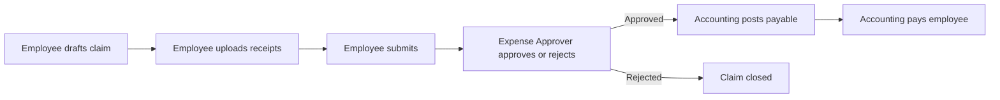

# Expense Reimbursement

Status: Canonical Phase 1A runtime contract
Code refs: `ifitwala_ed/hr/doctype/expense_claim/`, `ifitwala_ed/hr/expense_claims.py`, `ifitwala_ed/hr/expense_claim_permissions.py`, `ifitwala_ed/api/expense_claims.py`, `ifitwala_ed/api/expense_claim_receipts.py`, `ifitwala_ed/utilities/file_management.py`, `ifitwala_ed/ui-spa/src/pages/staff/ExpenseClaims.vue`
Test refs: `ifitwala_ed/hr/test_expense_claim_permissions.py`, `ifitwala_ed/utilities/test_file_management.py`; Frappe site workflow tests pending

## Scope

Expense reimbursement is a staff-first workflow for teachers and employees who paid for school-related expenses and need reimbursement.

Phase 1A deliberately keeps the claimant form category-first:

- staff select one of the default categories
- staff enter date, description, amount, and receipts
- staff do not select Item records
- staff do not select accounts
- accounting maps the approved claim to expense/payable/bank accounts during finance processing

This is separate from supplier invoice purchasing. Supplier, purchase request, purchase invoice, and outbound supplier payment remain a later payables phase.

## Workflow

The assigned approver is `Employee.expense_approver`. HR and system roles can override approval when required, but the normal school flow is one approver before accounting acts.

## Status Contract

`Expense Claim.status` is status-driven, not a submitted DocType lifecycle.

Allowed statuses:

- `Draft`
- `Submitted`
- `Approved`
- `Rejected`
- `Finance Review`
- `Payable Posted`
- `Paid`
- `Cancelled`

Only draft claims are editable by claimants. Workflow actions update locked claims through named APIs.

## Accounting Contract

Approval does not post GL.

Accounting posts payable after approval by selecting:

- one payable account
- one default expense account, or row-level expense accounts later

Posting creates GL entries against voucher type `Expense Claim`:

- debit expense account rows
- credit payable account with `party_type = Employee`

Payment uses `Payment Entry.payment_type = Pay` with `party_type = Employee` and an `Expense Claim` reference. It debits the employee payable and credits bank/cash.

## Receipt Contract

Receipts use governed Drive upload workflow `expense_claim.receipt`.

The browser receives only server-owned open/preview/thumbnail URLs. It must not construct `/private/...` paths or storage URLs.

Receipt context:

- owner: `Expense Claim`
- primary subject: `Employee`
- data class: `financial`
- purpose: `financial_record`
- retention policy: `fixed_7y`
- binding role: `expense_claim_receipt`

Read access is resolved through `Expense Claim` read permission before Drive grants are requested.

Desk receipt uploads must use the `Upload Receipt` action. The Desk form saves a dirty draft before opening the governed uploader so Drive receives a persisted `Expense Claim` name rather than a temporary `new-expense-claim-*` name.

Raw Frappe `File` attachments on `Expense Claim` are non-canonical and are rejected with an actionable message. Receipt files must be persisted through the governed `expense_claim.receipt` upload path.
